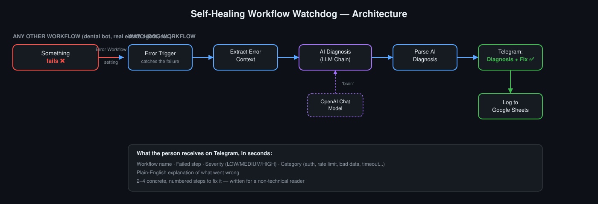

# 🛠️ Self-Healing Workflow Watchdog

An **AI meta-agent for n8n** that watches your other workflows, and the moment one fails — during testing or in production — it diagnoses the failure like a senior developer would and tells you exactly how to fix it, in plain English, straight to Telegram.

> Built as an "agent that debugs my other agents" — a small, focused automation that solves a real production-reliability problem instead of another lead-gen or chatbot demo.



## The problem

When an n8n workflow fails, you normally get a raw stack trace or nothing at all — you only find out when a client complains. Non-technical error messages are useless to non-technical stakeholders, and even for developers, digging through logs to find root cause takes time.

## The solution

This workflow acts as a **centralized error handler** for your entire n8n instance. Point any workflow's *Error Workflow* setting at this one, and every failure — from a test run or a live execution — gets:

1. **Caught instantly** via n8n's native Error Trigger
2. **Diagnosed by AI** acting as a senior n8n developer: category, root cause, severity, and whether it's safely re-runnable
3. **Explained in plain English** with 2–4 concrete fix steps, no jargon
4. **Delivered to Telegram** within seconds
5. **Logged to Google Sheets** for a running incident history

## Architecture

```
Any workflow fails
   → Error Trigger
   → Extract Error Context      (pulls workflow name, failed node, error message/stack)
   → AI Diagnosis (LLM Chain)   ⟶ powered by an OpenAI Chat Model sub-node
   → Parse AI Diagnosis         (parses category / severity / fix steps out of the AI's JSON response)
   → Telegram: Diagnosis & Fix Guide
   → Log to Google Sheets
```

## Setup

### 1. Import the workflow
Import `self-healing-workflow-watchdog.json` into your n8n instance.

### 2. Connect credentials
| Node | Credential needed |
|---|---|
| OpenAI Chat Model | OpenAI API key |
| Telegram: Diagnosis & Fix Guide | Telegram Bot token ([get one from @BotFather](https://core.telegram.org/bots#botfather)) — also replace the `chatId` placeholder with your own chat ID |
| Log to Google Sheets | Google Sheets OAuth — also replace the sheet ID placeholder |

### 3. Publish it
This workflow must be **published/active** — n8n only calls an Error Workflow that has an active version.

### 4. Connect your other workflows to it
For every workflow you want protected:
- Open it → **⋯ menu → Settings → Error Workflow** → select this workflow
- Make sure that workflow is also published — failure handling only fires for production/live executions, not manual test runs inside the editor

## Example output

> 🛠️ **Workflow Issue Detected**
>
> **Workflow:** Dental Booking Agent
> **Failed step:** Send WhatsApp Message
> **Severity:** HIGH
> **Category:** EXPIRED_AUTH
>
> **What happened:**
> The WhatsApp access token has expired, so the message could not be sent.
>
> **How to fix it:**
> 1. Open your WhatsApp Business API settings and generate a new access token.
> 2. Paste the new token into the credential used by this workflow in n8n.
> 3. Re-run the failed execution to confirm it now works.
>
> ⚠️ This needs the fix above before it will work again.
> 🔗 Execution: [link]

## Notes

- The auto-retry-via-API branch (calling n8n's public REST API to automatically re-run safely retryable failures) was intentionally left out of this version, since it requires n8n's Public API, which isn't available on all plans. The AI still tells you when a failure is a temporary glitch worth re-running — you just trigger the retry yourself.
- Model used: GPT-4o-mini (via the native n8n OpenAI Chat Model node) — swap for any model your OpenAI credential supports.

## Author

Built by Murtaza Mahboob — AI & Machine Learning Developer.
